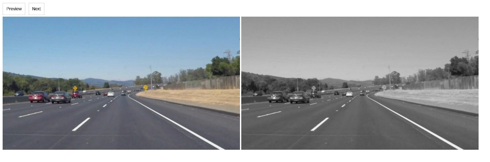
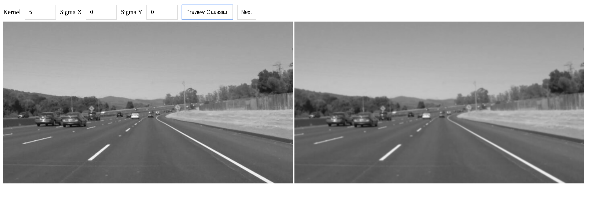
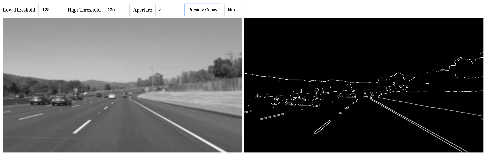
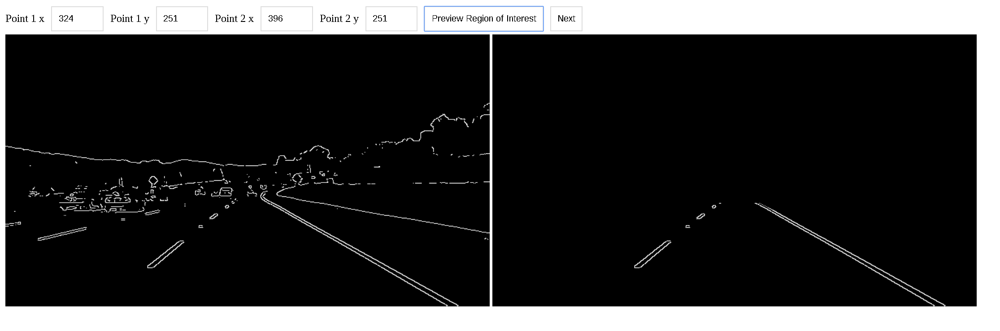
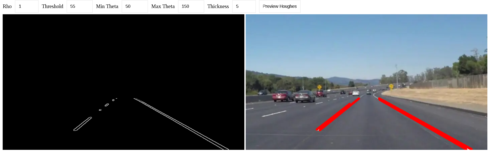

# Finding Lane Lines on the Road

## Lane Lines helper
This is a helper project to [Lane Lines project](https://github.com/Horki/CarND-LaneLines-P1)

## Run project
This project uses [WASM OpenCV](https://docs.opencv.org/3.4/d4/da1/tutorial_js_setup.html) and [Emscripten](https://emscripten.org/).
core functionality was written in C++, JS for DOM manipulation and wrapper around C++ calls.

More details on how to setup environment locally [here](BUILD.md).

```bash
mkdir build
cd build
${HOME}/emsdk/fastcomp/emscripten/emconfigure cmake ..
# nproc for linux; sysctl -n hw.ncpu for OsX
${HOME}/emsdk/fastcomp/emscripten/emmake make -j $(nproc)
cd ..
# copy all project(wasm build, static, img) files to web/ dir
python post_build.py
cd web
# init local instance
python -m http.server
```

## Pipeline

### 1. Convert to Gray


### 2. Gaussian Blur


### 3. Canny


### 4. Select region of interest


### 5. Result


## TODO
- [ ] Upload photo feature
- [ ] Better post build script
- [ ] Exception handling (both C++ and JS)
- [ ] Unit Tests
- [ ] Performance Tests
- [ ] Check memory leaks
- [ ] Add better UX/UI (without 3rd party lib, or JS framework)
- [ ] Create static instance of app